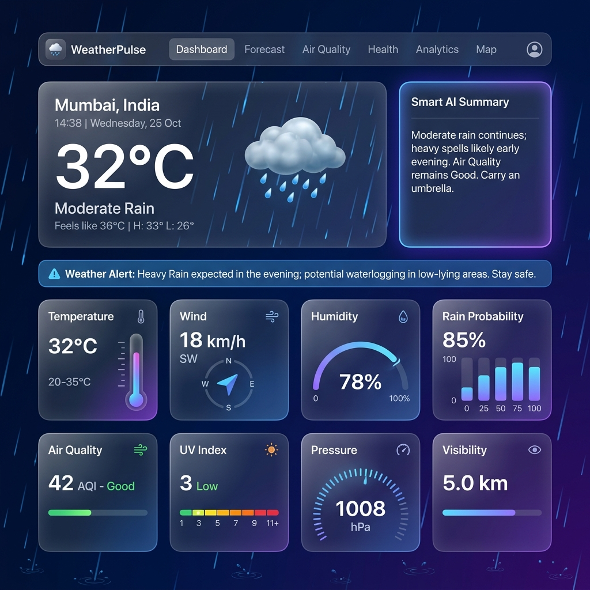
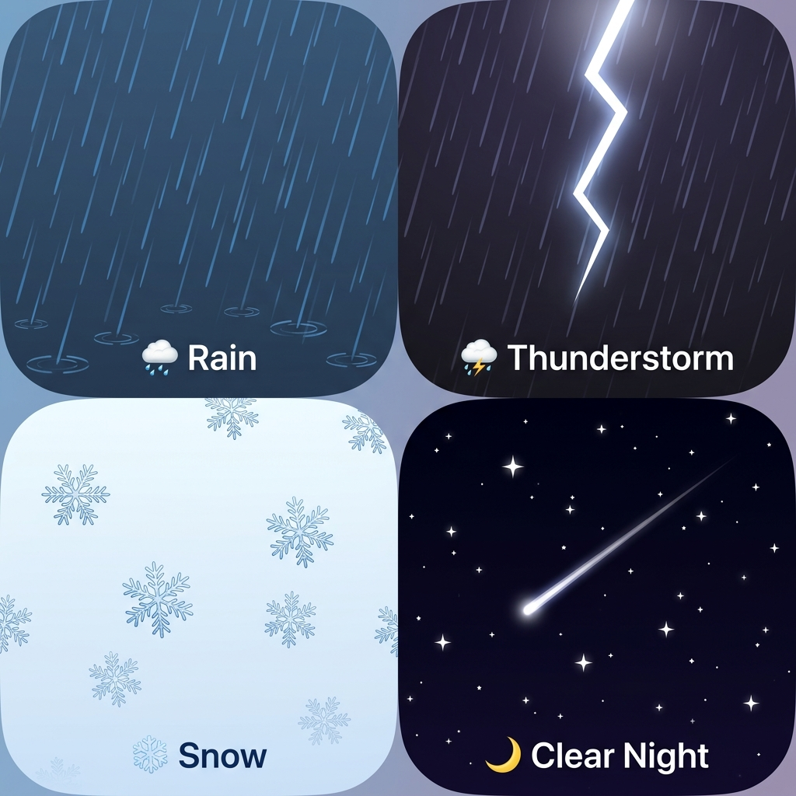
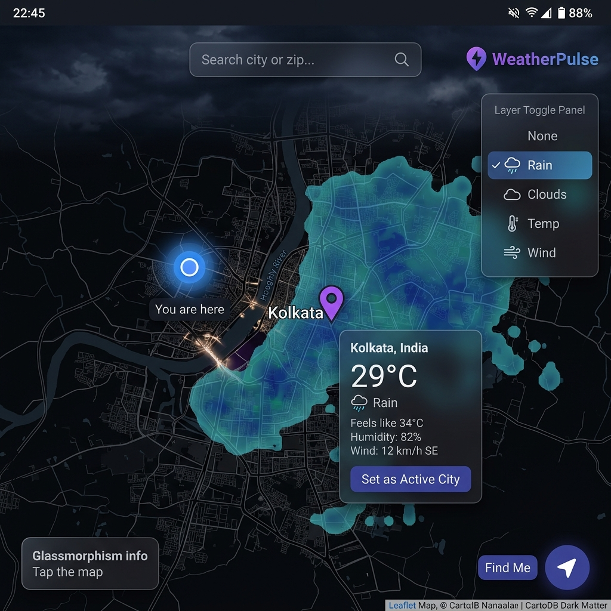
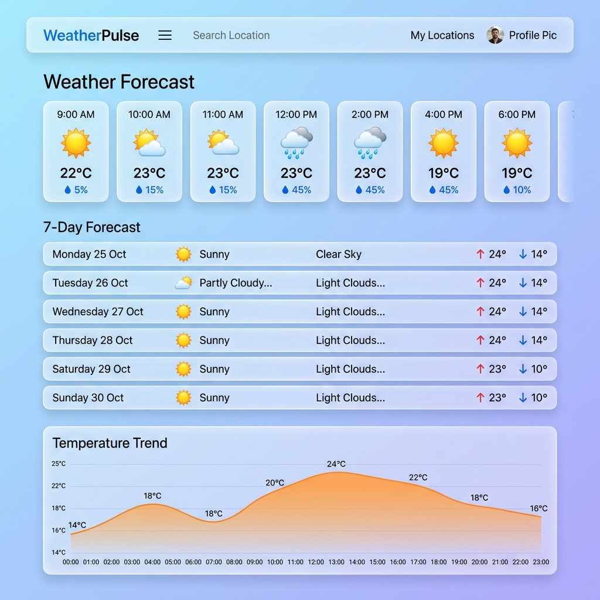

<div align="center">



<h1>🌤️ WeatherPulse</h1>

<p><strong>A beautiful, real-time weather dashboard with immersive animations, interactive maps, and smart health insights.</strong></p>

<p>
  
  
  
  
  
</p>

<p>
  <a href="https://github.com/Soumi14mili/WeatherPulse/stargazers"></a>
  <a href="https://github.com/Soumi14mili/WeatherPulse/network/members"></a>
</p>

</div>

---

## ✨ Features

### 🌧️ Real-Time Weather Animations
WeatherPulse renders immersive full-screen canvas animations that change dynamically with the actual weather:

| Condition | Animation |
|-----------|-----------|
| 🌧️ **Rain** | Layered rain streaks (depth effect) with elliptical **splash ripple rings** at the bottom |
| ⛈️ **Thunderstorm** | Heavy rain + **jagged zigzag lightning bolt** with glowing halo, branching forks, screen flash |
| ❄️ **Snow** | Realistic **6-pointed crystalline snowflakes** with sway, rotation, and branches |
| ☀️ **Clear Day** | **Rotating sun disk** with pulsing golden halo, 12 warm rays, shimmer dust particles |
| 🌙 **Clear Night** | **Twinkling stars** with pulse + periodic **shooting stars** streaking across the sky |
| ☁️ **Cloudy** | Layered cloud puffs with **depth parallax** (back/front layers) and soft shadows |
| 🌫️ **Fog** | Rolling multi-layer fog ribbons with slow drift |
| 💨 **Wind** | Curved **Bézier streaks** for organic wind feel |

The entire app background also **shifts colour with the weather** — dark blue for rain, deep purple for storms, ice blue for snow, midnight black for clear nights.

---



*Four of WeatherPulse's eight real-time weather animations — Rain, Thunderstorm, Snow, and Clear Night*

---

### 🗺️ Interactive Weather Map



- **Tap any place** on the map to instantly see weather: temperature, feels-like, humidity, wind speed, and condition emoji
- **Find Me** — locate your GPS position with a pulsing blue dot and accuracy radius circle
- **Custom location pins** — a purple active-city marker, distinct from the pulsing GPS dot
- **Weather Overlay Layers** — toggle Rain radar (🌧️), Clouds (☁️), Temperature (🌡️), and Wind (💨) over the map
- Rain radar works immediately via **free RainViewer** — no API key required
- Light / Dark tile themes that switch automatically with the app theme

---

### 📊 Dashboard & Widgets


- **AI Smart Summary** — a natural-language description of current conditions
- **Live weather alerts** — extreme temperature, poor AQI, high UV, and wind warnings
- **10 draggable widgets** — rearrange your dashboard via drag-and-drop (dnd-kit):
  - 🌡️ Temperature (current, feels-like, high/low)
  - 💧 Humidity with arc gauge
  - 💨 Wind speed + compass direction
  - 🔵 Atmospheric Pressure
  - ☀️ UV Index with risk level
  - 👁️ Visibility
  - 🌧️ Rain / Precipitation probability
  - 🌱 Air Quality Index (AQI)
  - 🌅 Sunrise & Sunset times
  - 🌙 Moon Phase
- **Share** current weather summary or **Export as PDF**

---

### 📈 Forecast & Analytics



- **24-hour hourly forecast** — horizontal scrollable cards with temperature, weather icon, and rain probability
- **7-day daily forecast** — with high/low temperatures and condition icons
- **Temperature trend chart** — smooth area chart (Recharts)
- **Analytics page** — 4 interactive charts for Temperature, Precipitation, Wind Speed, and Humidity — switchable between 24h and 7-day views

---

### 🫁 Air Quality & Health

- **AQI gauge** — animated arc gauge showing US AQI
- **Pollutant breakdown** — PM2.5, PM10, CO, NO₂, SO₂, O₃ with progress bars
- **24-hour AQI trend chart**
- **Health recommendations** based on current AQI
- **Health Advisor page** — personalized health tips based on weather, UV, and air quality

---

## 🚀 Tech Stack

| Technology | Purpose |
|---|---|
| **React 19** | UI framework |
| **Vite 6** | Build tool |
| **Tailwind CSS v4** | Styling with custom design tokens |
| **Framer Motion** | Page transitions and micro-animations |
| **Canvas API** | Real-time weather particle animations |
| **Leaflet + react-leaflet** | Interactive map |
| **Open-Meteo API** | Weather data (free, no key needed) |
| **Open-Meteo Air Quality** | AQI + pollutant data (free) |
| **RainViewer** | Free rain radar tile overlay |
| **Recharts** | Analytics charts |
| **dnd-kit** | Drag-and-drop widget reordering |
| **react-hot-toast** | Toast notifications |

---

## 🛠️ Getting Started

### Prerequisites
- Node.js 18+
- npm or yarn

### Installation

```bash
# Clone the repository
git clone https://github.com/Soumi14mili/WeatherPulse.git
cd WeatherPulse

# Install dependencies
npm install

# Start the development server
npm run dev
```

The app opens at **http://localhost:3000** — no API key required to get started!

### Optional: Weather Map Overlays

For full weather tile overlays (Clouds, Temperature, Wind layers), get a **free** API key from [openweathermap.org](https://openweathermap.org/api) and add it to `.env`:

```env
VITE_OWM_API_KEY=your_openweathermap_api_key_here
```

> Rain radar works immediately via RainViewer — **no key needed**.

---

## 📁 Project Structure

```
src/
├── components/
│   ├── animations/
│   │   ├── WeatherAnimationCanvas.jsx   # Full-screen canvas animation controller
│   │   └── weatherAnimations.css        # Animation CSS + transitions
│   ├── charts/
│   │   └── WeatherChart.jsx             # Reusable chart component (Recharts)
│   ├── common/                          # GlassCard, SearchBar, Skeleton, WeatherIcon...
│   ├── dashboard/                       # 10 weather widgets (Temp, Wind, Humidity...)
│   ├── layout/                          # Navbar, PageWrapper
│   └── map/
│       ├── WeatherMap.jsx               # Full interactive Leaflet map
│       └── MapWeatherOverlay.jsx        # Weather tile layer manager
├── context/
│   ├── WeatherContext.jsx               # Global weather state + data fetching
│   └── ThemeContext.jsx                 # Dark/light mode
├── pages/
│   ├── HomePage.jsx                     # Main dashboard
│   ├── ForecastPage.jsx                 # Hourly + 7-day forecast
│   ├── AirQualityPage.jsx               # AQI + pollutants
│   ├── HealthAdvisorPage.jsx            # Health recommendations
│   ├── AnalyticsPage.jsx                # Interactive charts
│   └── MapPage.jsx                      # Full-screen map explorer
├── services/
│   ├── weatherService.js                # Open-Meteo weather API
│   ├── airQualityService.js             # Open-Meteo AQI API
│   └── geocodingService.js              # Reverse geocoding
└── utils/
    ├── animationEngine.js               # Canvas particle animation engine v2
    ├── weatherCodes.js                  # WMO weather code → icon/description
    ├── smartSummary.js                  # AI-style weather summary generator
    └── ...
```

---

## 🌐 APIs Used (All Free)

| API | Usage | Key Required? |
|---|---|---|
| [Open-Meteo](https://open-meteo.com/) | Weather + forecast data | ❌ No |
| [Open-Meteo Air Quality](https://open-meteo.com/en/docs/air-quality-api) | AQI + pollutants | ❌ No |
| [Open-Meteo Geocoding](https://open-meteo.com/en/docs/geocoding-api) | City search | ❌ No |
| [CartoDB](https://carto.com/) | Map tiles (light + dark) | ❌ No |
| [RainViewer](https://www.rainviewer.com/api.html) | Rain radar map overlay | ❌ No |
| [OpenWeatherMap](https://openweathermap.org/api) | Cloud/Temp/Wind overlays | ✅ Free tier |

---

## 📸 More Screenshots

<table>
  <tr>
    <td width="50%"><br/><em>7-day forecast + temperature trend chart</em></td>
    <td width="50%"><br/><em>Interactive map with weather popup + layer controls</em></td>
  </tr>
</table>

---

## 🤝 Contributing

Contributions, issues and feature requests are welcome! Feel free to check the [issues page](https://github.com/Soumi14mili/WeatherPulse/issues).

1. Fork the project
2. Create your feature branch (`git checkout -b feature/AmazingFeature`)
3. Commit your changes (`git commit -m 'Add AmazingFeature'`)
4. Push to the branch (`git push origin feature/AmazingFeature`)
5. Open a Pull Request

---

## 📜 License

Distributed under the MIT License. See `LICENSE` for more information.

---

<div align="center">

Made with ❤️ by [Soumi14mili](https://github.com/Soumi14mili)

⭐ **Star this repo if you found it useful!** ⭐

</div>
